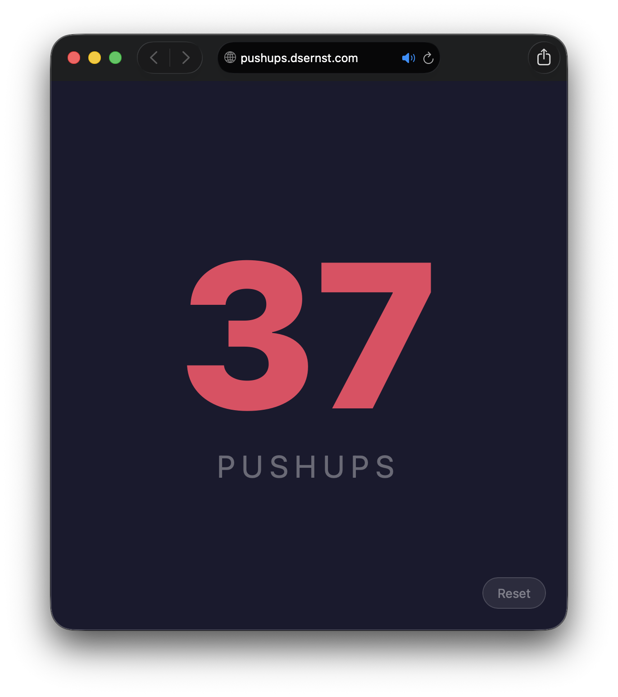

# Pushup Counter

A simple full-screen pushup counter designed to be easy to count, even with your nose. Tap anywhere on the screen to increment.



## Usage

- **Tap** anywhere on the screen to add one to the count

The display shows your current count in large type. Rapid taps are debounced so accidental double-counts are less likely.

## Local development

```bash
npm run dev
```

This opens `index.html` in your default browser. No build step or dependencies required.
